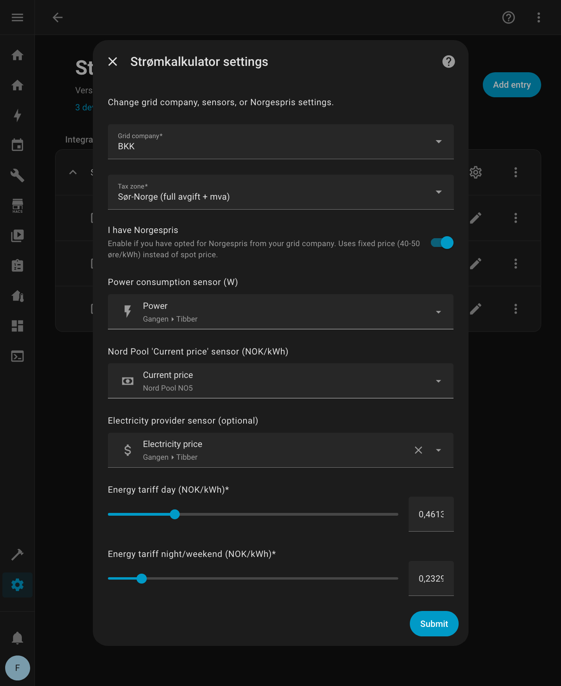
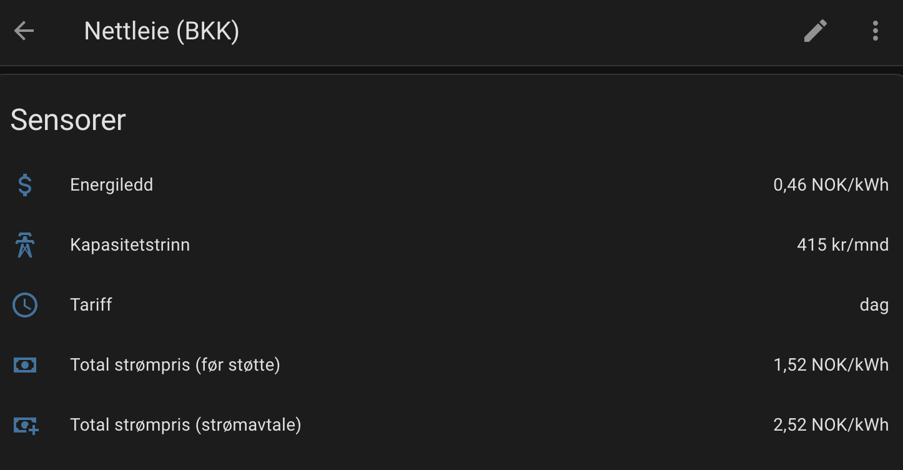
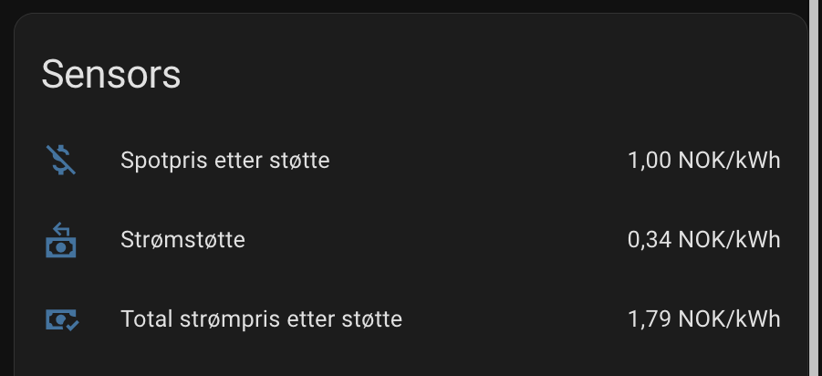
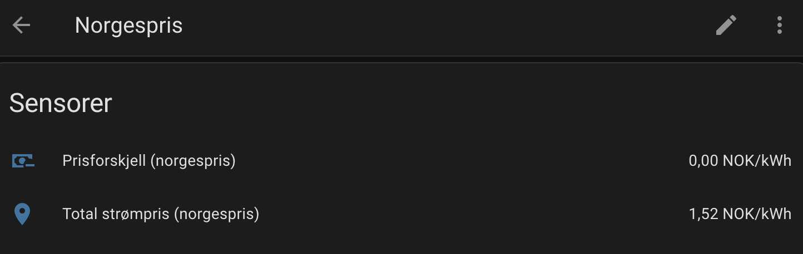
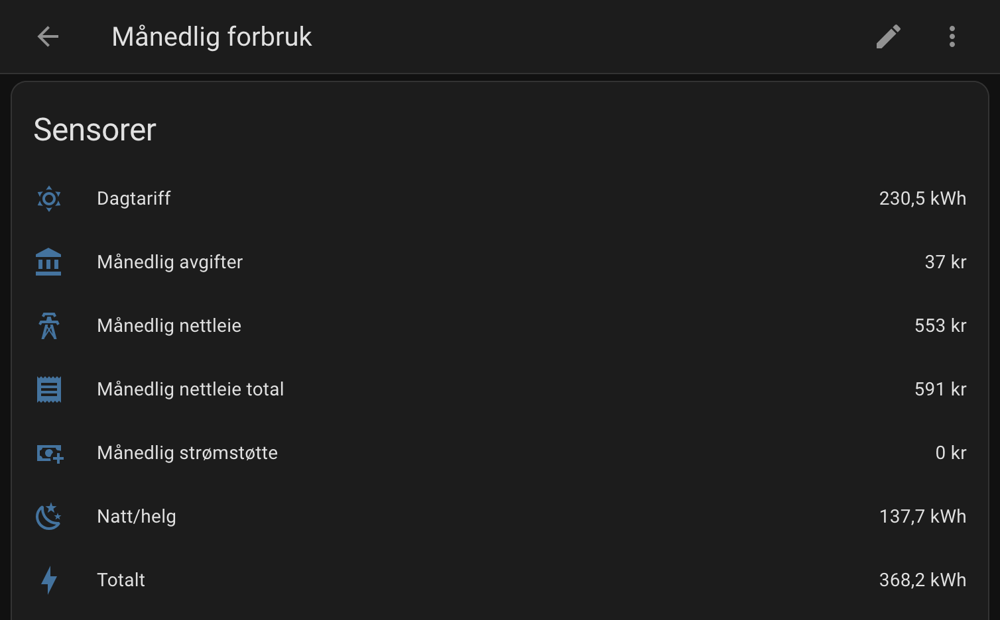
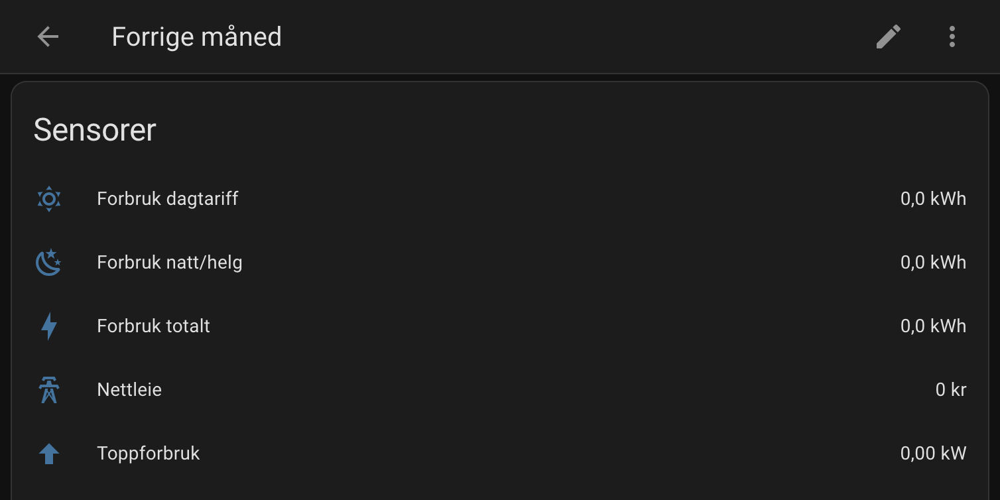
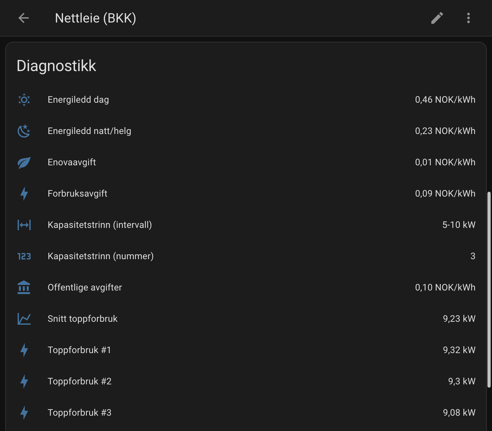

  

  
  
  
  
  
  

Home Assistant-integrasjon som beregner **faktisk strømpris** i Norge - inkludert nettleie, avgifter og strømstøtte.

## Hva du får

Integrasjonen gir deg sensorer som viser din **faktiske strømpris** - ikke bare spotprisen. Den regner ut:

- **Nettleie** - Energiledd (dag/natt) og kapasitetsledd fra ditt nettselskap
- **Strømstøtte** - Automatisk beregning (90% over 96,25 øre/kWh)
- **Totalpris** - Alt inkludert, klar for Energy Dashboard
- **Månedlig forbruk** - Sporer forbruk og kostnader per måned
- **Faktura-sjekk** - Sammenlign med fakturaen når den kommer

## Installasjon

### Via HACS (anbefalt)

1. Klikk på knappen under for å åpne integrasjonen i HACS:
   
2. Klikk **Download**
3. Start Home Assistant på nytt

*Alternativt: HACS > Integrations > Explore & Download Repositories > Søk etter "Strømkalkulator"*

### Manuell

Kopier `custom_components/stromkalkulator` til `/config/custom_components/`

## Oppsett

**Settings > Devices & Services > Add Integration > Strømkalkulator**

Du trenger:
- **Effektsensor** - Strømforbruk i Watt (f.eks. fra Tibber Pulse, P1 Reader, eller Elhub)
- **Spotpris-sensor** - Fra Nord Pool-integrasjonen

Velg ditt nettselskap fra listen. Alle 72 norske nettselskaper er støttet!

## Devices og sensorer

Integrasjonen oppretter fem devices med sensorer:

### Nettleie

Sanntids priser og beregninger for nettleie, strømstøtte og totalpris.

### Strømstøtte

Viser hvor mye du får i strømstøtte (90% over 96,25 øre/kWh).

### Norgespris

Sammenligner din spotprisavtale med Norgespris - så du kan se hva som lønner seg.

### Månedlig forbruk

Sporer forbruk og kostnader for inneværende måned, fordelt på dag- og natt/helg-tariff.

### Forrige måned

Lagrer forrige måneds data for enkel faktura-verifisering.

## Bruk med Energy Dashboard

For å se faktisk strømpris i Energy Dashboard:

1. **Settings > Dashboards > Energy**
2. Under "Electricity grid" > "Add consumption"
3. Velg din kWh-sensor (forbruksmåler)
4. **"Use an entity with current price"**: Velg **Totalpris inkl. avgifter**

Nå viser dashboardet hva strømmen faktisk koster deg - inkludert nettleie, avgifter og strømstøtte.

**Tips:** Vil du se priskomponentene (spotpris, nettleie, avgifter) separat? Bruk et custom dashboard-kort som ApexCharts med sensorene fra denne integrasjonen.

## Strømavtaler

### Spotpris (vanligste)

Hvis du har vanlig spotprisavtale:
- Strømstøtten (90% over 96,25 øre) trekkes automatisk fra
- Sensoren "Strømstøtte" viser hvor mye du får i støtte

### Norgespris

Har du valgt [Norgespris](https://www.regjeringen.no/no/tema/energi/strom/regjeringens-stromtiltak/) hos nettselskapet?

1. Kryss av "Jeg har Norgespris" i oppsett
2. Fast pris brukes: 50 øre (Sør-Norge) eller 40 øre (Nord-Norge)
3. Ingen strømstøtte - Norgespris erstatter spotpris og støtte

### Sammenligne avtalene

Usikker på hva som lønner seg? Sensoren "Prisforskjell Norgespris" viser:
- **Positiv verdi** = Du sparer med Norgespris
- **Negativ verdi** = Spotpris er billigere akkurat nå

## Sjekke mot faktura

Når nettleie-fakturaen kommer, kan du enkelt sjekke at tallene stemmer:

1. Gå til **Settings > Devices & Services > Strømkalkulator**
2. Klikk på "Forrige måned"-devicen
3. Sammenlign verdiene med fakturaen

**Tips:** Klikk på en sensor for å se detaljer som topp-3 effektdager og kostnader fordelt på dag/natt.

## Støttede nettselskaper

**Alle 72 norske nettselskaper er støttet!** 🎉

Prisene oppdateres årlig ved nyttår. Finner du feil eller utdaterte priser? [Opprett en PR](docs/CONTRIBUTING.md) eller et issue!

## Begrensninger

Integrasjonen er laget for **privatboliger med eget strømabonnement**.

**Forenklet modell:**
- Strømstøtte beregnes på alt forbruk (i virkeligheten maks 5000 kWh/mnd)
- For de fleste husholdninger er dette ikke et problem

**Ikke støttet (ennå):**
- Fritidsbolig (har 1000 kWh grense)
- Næringsliv (andre stønadssatser)
- Borettslag med fellesmåling

**Fremtidige ideer:**
- Varsel når kapasitetstrinn øker
- Støtte for fritidsbolig og næring
- Faktura-import (PDF/CSV)

## Dokumentasjon

| Dokument                                | Innhold                      |
|-----------------------------------------|------------------------------|
| [SENSORS.md](docs/SENSORS.md)           | Alle sensorer og attributter |
| [beregninger.md](docs/beregninger.md)   | Formler og avgiftssoner      |
| [CONTRIBUTING.md](docs/CONTRIBUTING.md) | Oppdatere priser / rapportere feil |
| [TESTING.md](docs/TESTING.md)           | Validere beregninger         |

## Lisens

MIT
