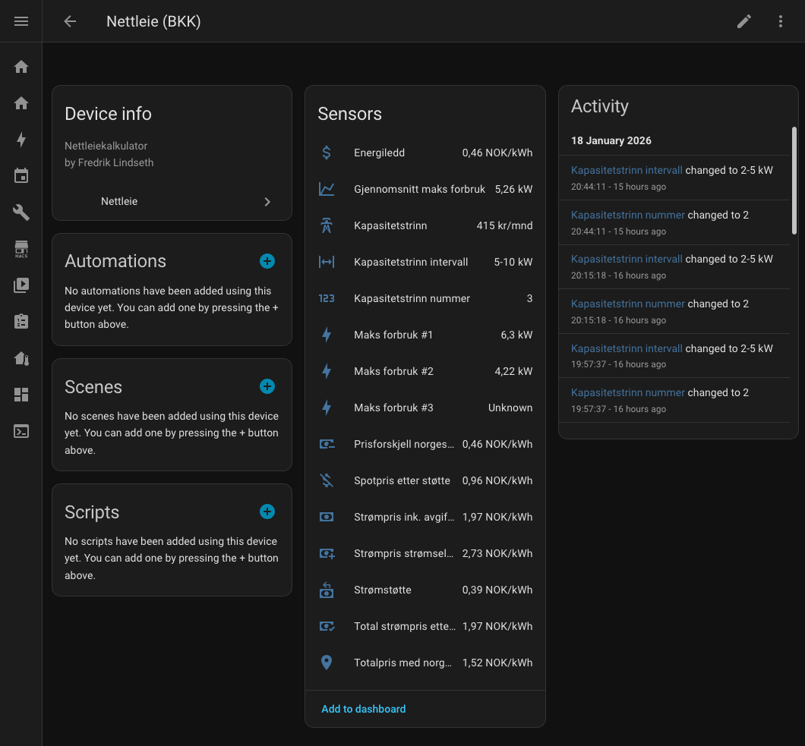

# Nettleie


[](https://github.com/hacs/integration)
[](https://github.com/fredrik-lindseth/nettleie/releases)
[](https://github.com/fredrik-lindseth/nettleie/stargazers)

Home Assistant integrasjon for beregning av nettleie for norske nettselskaper.

## Funksjoner

- **Støtte for flere nettselskaper** 
- **Energiledd-sensor**: Viser gjeldende energiledd basert på tid (dag/natt/helg/helligdager)
- **Kapasitetstrinn-sensor**: Beregner kapasitetstrinn basert på de 3 høyeste timene på 3 ulike dager
- **Total strømpris-sensor**: Viser total strømpris inkludert spotpris og nettleie
- **Strømstøtte-sensorer**: Beregner strømstøtte (90% over 70 øre) og viser priser etter støtte
- **Strømselskap + nettleie**: Valgfri sensor for total pris fra strømselskap (f.eks. Tibber) + nettleie


## Krav

- Nordpool-integrasjon eller en annen integrasjon som gir spotpris i strømsonen din.
- Strømforbruk-sensor i sanntid, f.eks:
  - [Tibber Pulse](https://tibber.com/no/pulse)
  - [AMS-leser.no](https://ams-leser.no/)
  - HAN-bussleser (tredjepart)
  - Sensor fra nettselskapet

## Installasjon

### Installasjon via HACS 

1. Åpne HACS i Home Assistant
2. Klikk på "Integrations"
3. Klikk på de tre prikkene øverst til høyre og velg "Custom repositories"
4. Legg til `https://github.com/fredrik-lindseth/nettleie` og velg "Integration" som kategori
5. Finn "Nettleie" i listen og klikk "Download"
6. Start Home Assistant på nytt (eller bruk Quick Reload under Developer Tools)

### Manuell installasjon

1. Kopier `custom_components/nettleie` mappen til din `config/custom_components/` mappe
2. Start Home Assistant på nytt

## Konfigurasjon

1. Gå til Settings → Devices & Services
2. Klikk "Add Integration"
3. Søk etter "Nettleie"
4. Velg nettselskap (f.eks BKK)
5. Velg din strømforbruk-sensor (f.eks. Tibber Pulse)
6. Velg Nord Pool **"Current price"** sensor (f.eks. `sensor.nord_pool_no5_current_price`)

**Viktig:** Velg "Current price" - IKKE "Today lowest" eller "Today average". "Current price" gir deg spotprisen for nåværende time, som er korrekt for strømstøtte-beregninger.


### Sensors Dashboard


## Sensorer

| Sensor                             | Beskrivelse                                     |
|------------------------------------|-------------------------------------------------|
| `sensor.energiledd`                | Energiledd i NOK/kWh                            |
| `sensor.kapasitetstrinn`           | Kapasitetsledd i kr/mnd                         |
| `sensor.strompris_ink_avgifter`    | Total strømpris i NOK/kWh                       |
| `sensor.maks_forbruk_1`            | Høyeste forbruk denne måneden (kW)              |
| `sensor.maks_forbruk_2`            | Nest høyeste forbruk denne måneden (kW)         |
| `sensor.maks_forbruk_3`            | Tredje høyeste forbruk denne måneden (kW)       |
| `sensor.gjennomsnitt_maks_forbruk` | Gjennomsnitt av topp 3 (kW)                     |
| `sensor.kapasitetstrinn_nummer`    | Kapasitetstrinn nummer (1-10)                   |
| `sensor.kapasitetstrinn_intervall` | Kapasitetstrinn intervall (f.eks. "5-10 kW")    |
| `sensor.electricity_company_total` | Strømpris fra strømselskap + nettleie (NOK/kWh) |
| `sensor.stromstotte`               | Strømstøtte per kWh (90% over 70 øre)           |
| `sensor.spotpris_etter_stotte`     | Spotpris minus strømstøtte (NOK/kWh)            |
| `sensor.total_pris_etter_stotte`   | Total strømpris etter strømstøtte (NOK/kWh)     |
| `sensor.total_pris_norgespris`    | Totalpris med norgespris (NOK/kWh)              |
| `sensor.prisforskjell_norgespris`   | Prisforskjell norgespris vs vanlig (NOK/kWh)     |

## Hvilken strømpris-sensor bør du bruke?

### Anbefalte sensorer for vanlig bruk:

| Bruksområde                | Anbefalt sensor                  | Hvorfor?                                                           |
|----------------------------|----------------------------------|--------------------------------------------------------------------|
| **Din faktiske strømpris** | `sensor.total_pris_etter_stotte` | Viser hva du faktisk betaler per kWh inkl. nettleie og strømstøtte |
| **Strømstøtte**            | `sensor.stromstotte`             | Viser hvor mye du får tilbake per kWh                              |
| **Spotpris**               | `sensor.spotpris_etter_stotte`   | Spotpris etter strømstøtte, uten nettleie                          |

### For spesielle behov:

| Situasjon                          | Sensor                           | Forklaring                                |
|------------------------------------|----------------------------------|-------------------------------------------|
| **Har strømselskap**              | `sensor.electricity_company_total` | Totalpris fra strømselskap + nettleie     |
| **Vil sammenligne med norgespris** | `sensor.total_pris_norgespris`  | Totalpris med norgespris (50 øre/kWh)     |
| **Vil se prisforskjell**           | `sensor.prisforskjell_norgespris` | Forskjell per kWh                        |

### Om Norgespris-sensorer
`sensor.total_pris_norgespris` 

- Fast pris: 50 øre/kWh (inkl. mva)
- Kan **IKKE** kombineres med strømstøtte
- Gjelder for strømforbruk hjemme og på hytte


## Konfigurasjonsfelt

| Felt                         | Beskrivelse                                                                              | Påkrevd |
|------------------------------|------------------------------------------------------------------------------------------|:-------:|
| **Nettselskap**              | Velg ditt nettselskap fra listen, eller "Egendefinert" for manuelle priser               |   Ja    |
| **Strømforbruk-sensor**      | Sensor som viser nåværende strømforbruk i W (f.eks. Tibber Pulse)                        |   Ja    |
| **Spotpris-sensor**          | Nord Pool "Current price" sensor (f.eks. `sensor.nord_pool_no5_current_price`)           |   Ja    |
| **Strømselskap-pris-sensor** | Sensor fra strømselskap med total pris (f.eks. Tibber). Brukes for `sensor.electricity_company_total` |   Nei   |
| **Energiledd dag**           | Manuell energiledd-pris for dag (kun ved "Egendefinert")                                 |   Nei   |
| **Energiledd natt**          | Manuell energiledd-pris for natt/helg (kun ved "Egendefinert")                           |   Nei   |

## Bidra

Vil du legge til støtte for ditt nettselskap? Følg guiden under og opprett en PR!

### Legge til nytt nettselskap (TSO)

1. Åpne `custom_components/nettleie/const.py`
2. Finn `TSO_LIST` dictionary
3. Legg til ditt nettselskap med følgende format:

```python
"ditt_nettselskap": {
    "name": "BKK",
    "energiledd_dag": 0.4613,      # NOK/kWh inkl. avgifter
    "energiledd_natt": 0.2329,     # NOK/kWh inkl. avgifter
    "url": "https://www.bkk.no/nettleiepriser/priser-privatkunder",
    "kapasitetstrinn": [
        (2, 150),      # 0-2 kW: 150 kr/mnd
        (5, 250),      # 2-5 kW: 250 kr/mnd
        (10, 400),     # 5-10 kW: 400 kr/mnd
        (15, 600),     # 10-15 kW: 600 kr/mnd
        (20, 800),     # 15-20 kW: 800 kr/mnd
        (25, 1000),    # 20-25 kW: 1000 kr/mnd
        (50, 1800),    # 25-50 kW: 1800 kr/mnd
        (75, 2600),    # 50-75 kW: 2600 kr/mnd
        (100, 3500),   # 75-100 kW: 3500 kr/mnd
        (float("inf"), 7000),  # >100 kW: 7000 kr/mnd
    ],
},
```

**Viktig:**
- `energiledd_dag` og `energiledd_natt` skal være i **NOK/kWh** (ikke øre)
- Prisene skal være **inkludert avgifter** (Enova, elavgift, mva)
- `kapasitetstrinn` er en liste med tupler: `(kW-grense, kr/mnd)`
- Dag = hverdager 06:00-22:00, Natt = 22:00-06:00 + helg + helligdager


### Sjekkliste for PR

Før du sender inn en PR, sjekk at:

1. Nettselskapet er lagt til i `TSO_LIST` i `const.py`
2. `url` peker til nettselskapets offisielle prisside
3. Prisene er i **NOK/kWh** (f.eks. `0.45`, ikke 45 øre)
4. Prisene **inkluderer avgifter** (Enova, elavgift, mva)
5. Alle kapasitetstrinn er med (typisk 8-10 trinn)
6. Siste trinn bruker `float("inf")` som øvre grense