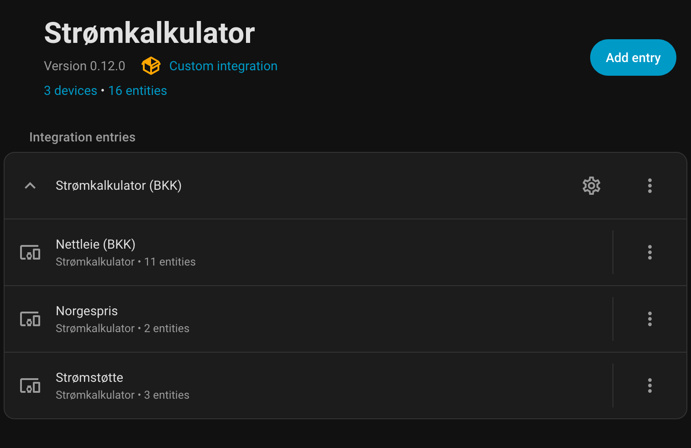
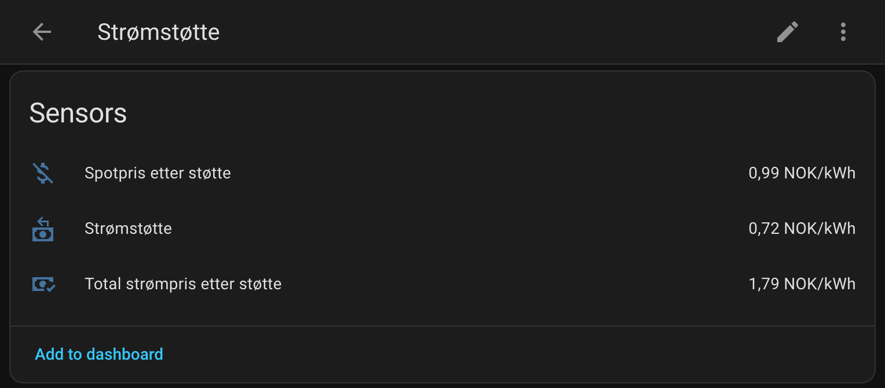
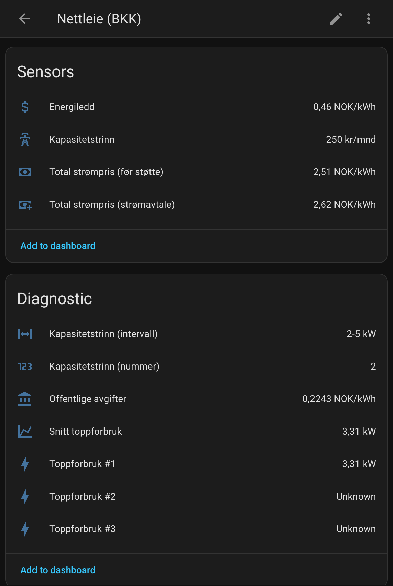

# Stromkalkulator

[](https://github.com/hacs/integration)
[](https://github.com/fredrik-lindseth/Stromkalkulator/releases)

Home Assistant-integrasjon som beregner **faktisk strompris** i Norge - inkludert nettleie, avgifter og stromstotte.



## Hva dette gir deg

En sensor (`sensor.total_strompris_etter_stotte`) som viser din **faktiske strompris per kWh**, inkludert:

- Spotpris fra Nord Pool
- Nettleie (energiledd dag/natt + kapasitetsledd)
- Offentlige avgifter (forbruksavgift + Enova)
- Minus stromstotte (90% over 96,25 ore/kWh inkl. mva)

## Installasjon

### Via HACS

1. HACS > Integrations > Meny (tre prikker) > Custom repositories
2. Legg til `https://github.com/fredrik-lindseth/Stromkalkulator` som "Integration"
3. Last ned "Stromkalkulator"
4. Start Home Assistant pa nytt

### Manuell

Kopier `custom_components/stromkalkulator` til `/config/custom_components/`

## Konfigurasjon

**Settings > Devices & Services > Add Integration > Stromkalkulator**

Du trenger:
- **Effektsensor** - Stromforbruk i Watt (f.eks. Tibber Pulse)
- **Spotpris-sensor** - Nord Pool "Current price" (f.eks. `sensor.nord_pool_no5_current_price`)

### Oppsett basert pa din stromavtale

#### Med Norgespris (fra nettselskapet)

Hvis du har valgt [Norgespris](https://www.regjeringen.no/no/tema/energi/strom/regjeringens-stromtiltak/id2900232/) hos nettselskapet:

1. **Konfigurer integrasjonen** med "Jeg har Norgespris" avkrysset
2. Bruker fast pris: **50 ore/kWh** (Sor-Norge) eller **40 ore/kWh** (Nord-Norge/Tiltakssonen)
3. Ingen stromstotte - Norgespris erstatter bade spotpris og stotte
4. Bruk `sensor.total_strompris_etter_stotte` i Energy Dashboard

> **Merk:** Norgespris inkluderer mva. Nord-Norge har mva-fritak, derfor lavere pris.

#### Med spotpris og stromstotte (standard)

Hvis du har vanlig spotprisavtale med stromstotte:

1. Bruk `sensor.total_strompris_etter_stotte` i Energy Dashboard
2. Sensor `sensor.stromstotte` viser stottebelop per kWh
3. Stotten (90% over 96,25 ore/kWh) trekkes automatisk fra i totalprisen



#### Uten stromstotte

Hvis du ikke har stromstotte (f.eks. naring, hytte, eller Nord-Norge med lave priser):

1. Bruk `sensor.total_strompris_for_stotte` for totalpris uten stotte
2. Eller bruk `sensor.nettleie_total` hvis du kun vil se nettleie

### Sammenligne spotpris vs Norgespris

Usikker pa om Norgespris lønner seg for deg?

- `sensor.prisforskjell_norgespris` viser forskjellen mellom spotpris og Norgespris
- Positiv verdi = du sparer med Norgespris
- Negativ verdi = spotpris er billigere

### Begrensninger

Denne integrasjonen stotter **privatboliger med eget stromabonnement**.

**Forenklet modell:**
- **Forbruk over 5000 kWh/mnd**: Integrasjonen beregner stromstotte pa alt forbruk. I virkeligheten far du kun stotte pa de forste 5000 kWh. For de fleste husholdninger er dette ikke et problem.
- **Norgespris over 5000 kWh**: Samme forenkling - vi antar at alt forbruk far Norgespris.

**Ikke stottet:**
- **Fritidsbolig** - Har 1000 kWh grense for stromstotte (ikke 5000 kWh)
- **Naringsliv** - Har andre stonadssatser
- **Fjernvarme/narvarme** - Egen stotteordning
- **Borettslag med fellesmaling** - Stotte utbetales til borettslaget

## Energy Dashboard

For a vise faktisk strompris i Energy Dashboard:

1. **Settings > Dashboards > Energy**
2. Under "Electricity grid" > "Add consumption"
3. Velg din kWh-sensor (f.eks. `sensor.tibber_pulse_*_accumulated_consumption`)
4. **"Use an entity with current price"**: Velg `sensor.total_strompris_etter_stotte`

## Sensorer

| Sensor                                | Beskrivelse                                           |
|---------------------------------------|-------------------------------------------------------|
| `sensor.total_strompris_etter_stotte` | Din faktiske totalpris (for Energy Dashboard)         |
| `sensor.stromstotte`                  | Stotte per kWh                                        |
| `sensor.kapasitetstrinn`              | Manedlig kapasitetskostnad                            |
| `sensor.tariff`                       | "dag" eller "natt" (natt er ogsa helg og helligdager) |
| `sensor.prisforskjell_norgespris`     | Sammenligning med Norgespris                          |




Se [docs/beregninger.md](docs/beregninger.md) for alle sensorer og formler.

## Verifisere mot faktura

For a sjekke at integrasjonen beregner riktig, sammenlign med fakturaen fra nettselskapet.

### Komplett oppsett for faktura-verifisering

1. **Kopier utility-pakken:**
   ```bash
   cp packages/stromkalkulator_utility.yaml /config/packages/
   ```

2. **Rediger filen** - bytt ut `sensor.BYTT_EFFEKT_SENSOR` med din effekt-sensor (W)

3. **Aktiver packages** i `configuration.yaml`:
   ```yaml
   homeassistant:
     packages: !include_dir_named packages
   ```

4. **Start Home Assistant pa nytt**

### Sensorer du far

Etter oppsett far du disse sensorene for faktura-sammenligning:

| Sensor                              | Beskrivelse                    | Matcher faktura-post      |
|-------------------------------------|--------------------------------|---------------------------|
| `sensor.strom_maanedlig_dag`        | kWh pa dag-tariff              | Energiledd dag (forbruk)  |
| `sensor.strom_maanedlig_natt`       | kWh pa natt-tariff             | Energiledd natt (forbruk) |
| `sensor.maanedlig_energiledd_dag`   | Energiledd dag i kr            | Energiledd dag (sum)      |
| `sensor.maanedlig_energiledd_natt`  | Energiledd natt i kr           | Energiledd natt (sum)     |
| `sensor.kapasitetstrinn`            | Kapasitetsledd i kr            | Kapasitetsledd            |
| `sensor.maanedlig_forbruksavgift`   | Forbruksavgift i kr            | Forbruksavgift            |
| `sensor.maanedlig_enovaavgift`      | Enova-avgift i kr              | Enovaavgift               |
| `sensor.maanedlig_stromstotte`      | Stromstotte i kr               | Midlert. stromstønad      |
| `sensor.maanedlig_nettleie_etter_stotte` | Totalt a betale           | A betale                  |

### Eksempel: BKK-faktura desember 2025

```
Faktura fra BKK:                      Stromkalkulator:
─────────────────────────────────────────────────────────────────
Energiledd dag:    667 kWh = 240 kr   sensor.maanedlig_energiledd_dag: ~240 kr
Energiledd natt:   887 kWh = 211 kr   sensor.maanedlig_energiledd_natt: ~211 kr
Kapasitetsledd:    5-10 kW = 415 kr   sensor.kapasitetstrinn: 415 kr
Forbruksavgift:   1555 kWh = 244 kr   sensor.maanedlig_forbruksavgift: ~244 kr
Enovaavgift:      1555 kWh =  19 kr   sensor.maanedlig_enovaavgift: ~19 kr
Stromstotte:      1107 kWh = -122 kr  sensor.maanedlig_stromstotte: ~122 kr
─────────────────────────────────────────────────────────────────
A betale:                  1006 kr    sensor.maanedlig_nettleie_etter_stotte: ~1006 kr
```

### Forventet avvik

- **1-5% avvik er normalt** - skyldes avrunding og maleravvik
- **Stromstotte kan avvike mer** - fakturaen bruker time-for-time priser, vi bruker gjennomsnitt
- **Storre avvik?** Sjekk at energiledd-satsene i integrasjonen matcher nettselskapets prisliste

## Stottede nettselskaper

Arva, Barents Nett, BKK, Elinett, Elmea, Elvia, Fagne, Foie, Glitre Nett, Griug, Lede, Linea, Linja, Lnett, Mellom, Midtnett, Nettselskapet, Noranett, Norgesnett, Nordvest Nett, Tensio, Vevig, + Egendefinert

Mangler ditt? Se [docs/CONTRIBUTING.md](docs/CONTRIBUTING.md)

## Dokumentasjon

| Dokument                                | Innhold                          |
|-----------------------------------------|----------------------------------|
| [beregninger.md](docs/beregninger.md)   | Formler, avgiftssoner, eksempler |
| [CONTRIBUTING.md](docs/CONTRIBUTING.md) | Legge til nettselskap            |
| [TESTING.md](docs/TESTING.md)           | Validere beregninger             |
| [DEVELOPMENT.md](docs/DEVELOPMENT.md)   | Utviklerinfo                     |
| [ARCHITECTURE.md](docs/ARCHITECTURE.md) | Arkitektur og design             |

## Lisens

MIT
